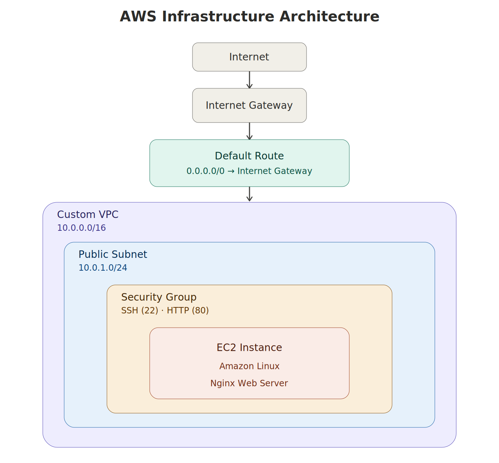
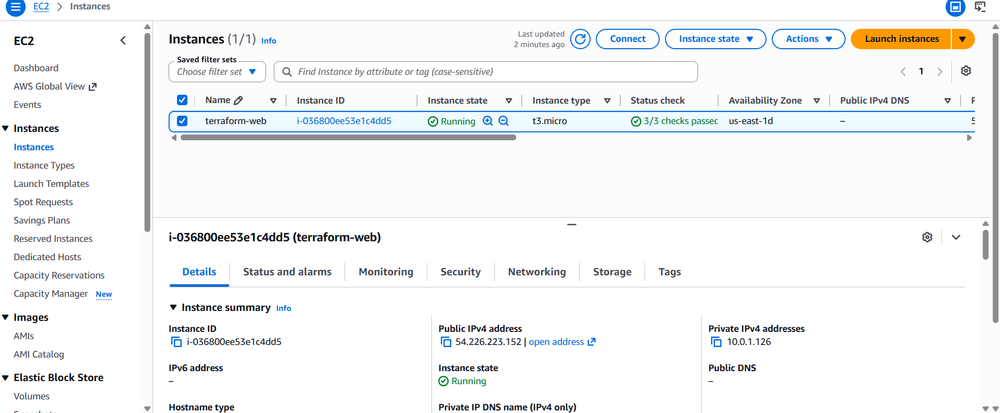
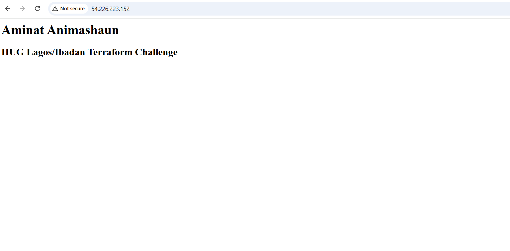
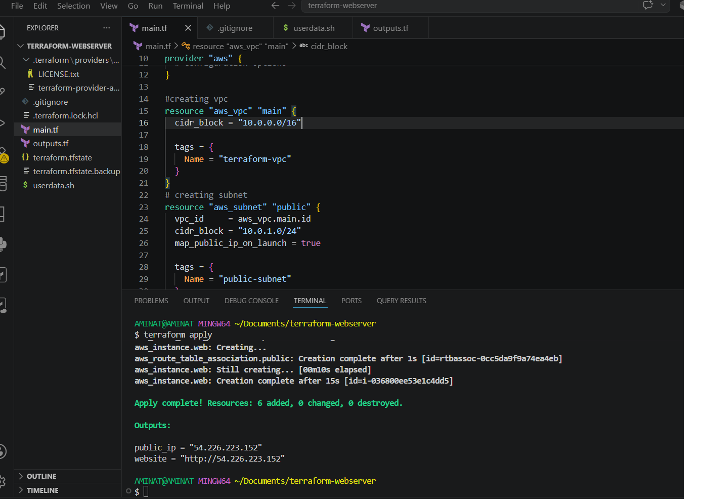

# Terraform Webserver

## Project Overview

This project provisions a fully functional Nginx web server on AWS using Terraform. It demonstrates Infrastructure as Code (IaC) concepts such as network provisioning, security configuration, automated server bootstrapping, and resource dependency management.

The project was implemented as part of **Week 1 of the HUG Lagos/Ibadan Terraform Challenge**.

---

## Architecture

The diagram below illustrates the AWS infrastructure provisioned using Terraform.



---

## Technologies Used

- Terraform
- AWS EC2
- AWS VPC
- Nginx
- Bash (user_data)

---

## Project Structure

```text
terraform-webserver/
├── images/
│   ├── architecture.png
│   ├── ec2-running.png
│   └── webpage.png
├── main.tf
├── outputs.tf
├── userdata.sh
├── README.md
├── .gitignore
└── .terraform.lock.hcl
```


## Resources Provisioned

Terraform provisions:

- Custom VPC
- Public Subnet
- Internet Gateway
- Route Table
- Route Table Association
- Security Group
  - SSH (22)
  - HTTP (80)
- EC2 Instance
- Nginx Web Server

---

## Prerequisites

- AWS Account
- Terraform installed
- AWS CLI installed
- Git installed

Configure your AWS credentials:

```bash
aws configure
```

---

## Deployment

Clone the repository:

```bash
git clone https://github.com/aminatanimashaun31/Terraform-Webserver.git
```

Navigate into the project:

```bash
cd Terraform-Webserver
```

Initialize Terraform:

```bash
terraform init
```

Validate the configuration:

```bash
terraform validate
```

Review the execution plan:

```bash
terraform plan
```

Deploy the infrastructure:

```bash
terraform apply
```

Type `yes` when prompted.

---

## Outputs

After deployment Terraform displays:

- EC2 Public IP Address
- Website URL

Example:

```text
public_ip = "54.xxx.xxx.xxx"

website = "http://54.xxx.xxx.xxx"
```

---

## Screenshots

### EC2 Instance Running



### Nginx Web Server



### VScode Terminal



---

## Clean Up

To avoid unnecessary AWS charges:

```bash
terraform destroy
```

Type `yes` when prompted.

---

## Author

**Aminat Animashaun**

GitHub: https://github.com/aminatanimashaun31
